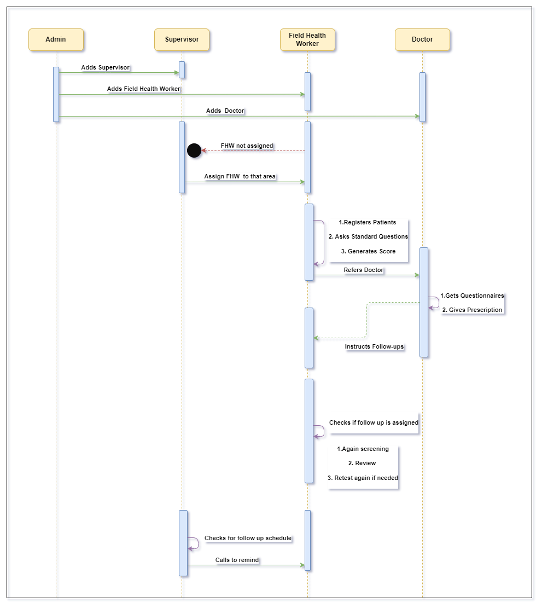

# Mental Health Screening and Management System

## Project Overview

The Mental Health Screening and Management System aims to streamline the process of identifying and treating mental health conditions in communities through the collaboration of field health workers, doctors, supervisors, and administrators. This system utilizes a tablet-based application to facilitate efficient data collection, patient management, and follow-up scheduling. With features like offline capability, multilingual support, and secure user authentication, the system ensures accessibility and data integrity.

## Table of Contents
1. [Project Description](#project-description)
2. [Actors and Their Roles](#actors-and-their-roles)
3. [Functionalities](#functionalities)
    - [Admin](#admin)
    - [Supervisor](#supervisor)
    - [Field Health Worker](#field-health-worker)
    - [Doctor](#doctor)

## Project Description

The Mental Health Screening and Management System involves the following components:

- **Field Health Workers (FHW)** visit households and screen family members using a standardized questionnaire.
- Identified individuals with mental health conditions are referred to local doctors for evaluation and treatment.
- Doctors evaluate patients, prescribe treatment, and schedule follow-ups as necessary, recording diagnoses with ICD10 codes.
- Health workers use a tablet-based app for data collection, scheduling, and offline capability.
- Doctors have access to patient data, summary statistics, and district-level insights.
- The system provides an API for a state-level dashboard displaying program data.
- Multilingual support is available for field workers.

## Actors and Their Roles

1. **Admin**: Manages user accounts and system settings.
2. **Supervisor**: Oversees assigned areas and monitors health workers.
3. **Doctor**: Evaluates patients, prescribes treatment, and monitors patient progress.
4. **Field Health Worker**: Conducts screenings, registers patients, and conducts follow-ups.

## Functionalities

### Admin

- **Admin Login**: Secure access for administrators.
- **User Management**: Register and manage supervisors, health workers, and doctors.

### Supervisor

- **Supervisor Login**: Secure access for supervisors.
- **Area-wise Management**: View assigned health workers and patients, and manage follow-ups.
- **Health Worker Assignment**: Efficient allocation of health workers to designated areas.
- **Monitoring Follow-ups**: Record and manage follow-up appointments.

### Field Health Worker

- **Healthcare Worker Login**: Secure access for health workers.
- **Offline Capabilities**: Access patient schedules and administer questionnaires offline.
- **Patient Registration**: Capture demographic information and conduct screenings.
- **Standard Questionnaire**: Collect standardized data for patient assessment.
- **Referral to Doctor**: Facilitate patient referrals to local doctors.
- **Prescription Printing**: Print prescriptions during follow-up visits.
- **Recovery Rating and Follow-up**: Assess patient recovery and manage follow-up appointments.
- **Security Measures**: Implement measures to safeguard patient data.
- **Notification System**: Receive reminders for upcoming follow-ups.

### Doctor

- **Doctor Login**: Secure access for doctors.
- **Bucket List**: View patient lists based on assigned buckets.
- **Demographic Panel**: View patient information and upload prescriptions.
- **Prescription**: Add/edit patient prescriptions.
- **Follow-ups**: Schedule follow-ups for patients.
- **History**: View patient history including past prescriptions and follow-ups.
- **Dashboard**: View graphical representation of patient data.

### Database Design

### API Documentation

### Use Case Diagram
#### Web App Use Case Diagram

#### Mobile App Use Case Diagram

### Sequence Diagram

### Flow Diagrams for Roles

#### Admin Flow Diagram

#### Supervisor Flow Diagram

#### Field Health Worker Flow Diagram

#### Doctor Flow Diagram

## Milestones
- [Milestone - 1](Milestones/Milestone-1)
- [Milestone - 2](Milestones/Milestone-2)

## Contributors

- **Vraj Jatin Naik**
   - Email: [Vraj.Naik@iiitb.ac.in](mailto:Vraj.Naik@iiitb.ac.in)

- **Arjun Gangani**
   - Email: [Arjun.Gangani@iiitb.ac.in](mailto:Arjun.Gangani@iiitb.ac.in)

## Team - 12 HAD Project - 6
### TA:
- **Jayaa Shree Laxmi Kishoore**
### Team Members
- #### Team Representative:
- **Tanvi Motwani**
   - Email: [Tanvi.Motwani@iiitb.ac.in](mailto:Tanvi.Motwani@iiitb.ac.in)

- #### Members:
- **Harsh Ranpariya**
   - Email: [Harsh.Ranpariya@iiitb.ac.in](mailto:Harsh.Ranapriya@iiitb.ac.in)

- **Nikita Gupt**
   - Email: [Nikita.Gupta@iiitb.ac.in](mailto:Nikita.Gupta@iiitb.ac.in)

- **Vraj Jatin Naik**
   - Email: [Vraj.Naik@iiitb.ac.in](mailto:Vraj.Naik@iiitb.ac.in)

- **Arjun Gangani**
   - Email: [Arjun.Gangani@iiitb.ac.in](mailto:Arjun.Gangani@iiitb.ac.in)
